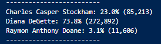

# Pypoll Challenge

## Overview

A board of elections employee has requested our help with the audit of election results for a recent local congressional election. The purpose of this challenge is to demonstrate how python can be used to accurately and rapidly answer several key questions regarding an election. 

## Results

Using the results of our analysis we can answer the following questions:

1. How many votes were cast this congressional election?

    

2. Provide a breakdown of the number of votes and percent of total votes for each county in the precinct.

    

3. Which county had the largest number of votes?

    

4. Provide a breakdown of the number of votes and the percent of the total votes each candidate received.

    

5. Which candidate won the election, what was their vote count, and what was their percentage of the total votes?

    

## Summary

Based on the analysis conducted, I believe that this script could be used in similar future elections and could be adjusted to accomodate other purposes. Because of the manner in which it is written, the script could easily be used for elections in which there are more candidates and votes as it will simply store votes tied to each candidate. However, for elections in which more than one seat may be in contention we could simply alter the script by creating a dictionary in which the keys are positions contested and the values take the form of a list where the items are candidates, votes, location, and potentially other important details. This would require us to change the few lines of the code that refer to these details but the logic would remain. 